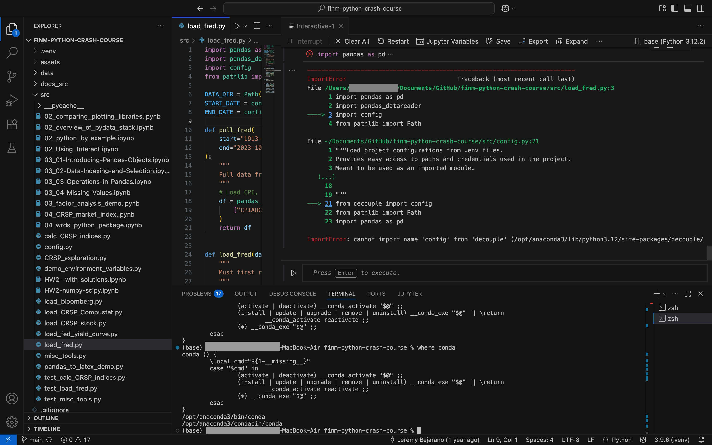

# 1.4 Common Errors When Setting Up VS Code and Python

This document contains solutions to frequently encountered errors when setting up VS Code with Python and Jupyter environments.

---

## Error 1: Different Python Environments in Terminal vs Jupyter

### Problem

[](https://xkcd.com/1987/)

Your code works in the terminal but fails in Jupyter (or vice versa) with import errors, even though both claim to use the same environment (e.g., "base").

### What's happening

VS Code (and Jupyter) can have multiple Python interpreters installed:
- System Python (came with your OS)
- Anaconda Python (if you installed Anaconda)
- Python.org Python (if you downloaded from python.org)
- Virtual environment Python (if you created venvs)

The terminal and Jupyter kernel might be using different Python installations, even if they have the same version number or environment name.

### Diagnosing the issue

1. **Check Python location in Terminal:**
   ```bash
   which python
   # or on Windows: where python
   ```

2. **Check Python location in Jupyter:**
   ```python
   import sys
   print(sys.executable)
   ```

3. **Compare installed packages:**
   In Terminal:
   ```bash
   pip list | grep <package_name>
   ```
   
   In Jupyter:
   ```python
   !pip list | grep <package_name>
   ```

If the paths don't match, you're using different Python environments.

### Solution

#### Option 1: Install Jupyter kernel for your environment

```bash
# Activate your correct environment first
conda activate base  # or your env name

# Install ipykernel
pip install ipykernel

# Register the kernel
python -m ipykernel install --user --name myenv --display-name "Python (myenv)"
```

Then in VS Code/Jupyter, select this kernel from the kernel picker.

#### Option 2: Use VS Code's Python selection

1. Open Command Palette (Cmd/Ctrl + Shift + P)
2. Type "Python: Select Interpreter"
3. Choose the same Python that your terminal uses
4. Restart Jupyter kernel

### Cleaning up duplicate kernels

List all kernels:
```bash
jupyter kernelspec list
```

Remove unwanted ones:
```bash
jupyter kernelspec remove <kernel_name>
```

---

## Error 2: Wrong `decouple` Package Installed

### Problem



You get this error when trying to import decouple:
```python
from decouple import config
# ModuleNotFoundError: No module named 'decouple'
```

### What's happening

There are TWO different packages with similar names:
- `decouple` - This is the wrong package (it's a different library)
- `python-decouple` - This is the correct package that we need

If you accidentally installed `decouple` first, then trying to install `python-decouple` won't work properly because pip thinks "decouple" is already installed, even though they're completely different packages.

### Diagnosing the issue

Check which package is installed:
```bash
pip show decouple
pip show python-decouple
```

If `decouple` shows up but `python-decouple` doesn't, you have the wrong package.

### Solution

1. **Uninstall the wrong package:**
   ```bash
   pip uninstall decouple -y
   ```

2. **Install the correct package:**
   ```bash
   pip install python-decouple
   ```

3. **Verify it worked:**
   ```python
   from decouple import config  # This should work now
   ```

### Important note

Always install `python-decouple`, not `decouple`. Despite their similar names, they are completely different packages.

---

## Error 3: [To be added]

---

## Error 4: [To be added]
