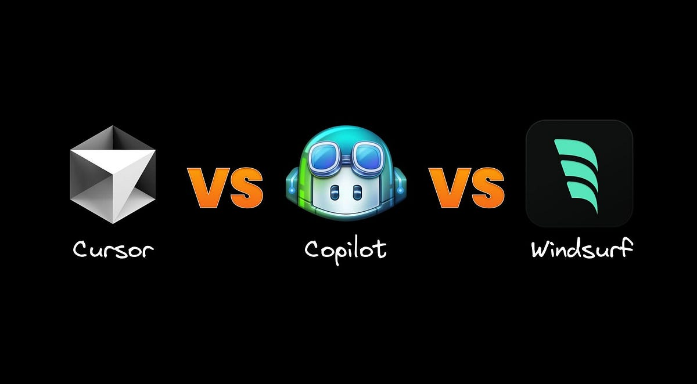
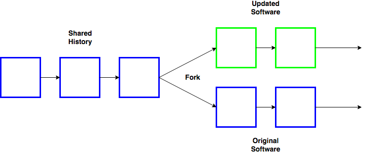

# 1.3 VS Code and Cursor

## The AI Code Editor Wars

### The Foundation: VS Code

VS Code is Microsoft's free, open-source code editor that dominates the market. Released in 2015, it has become the most popular code editor among developers.

### Enter Cursor: The AI-First Editor

In 2022, a team of MIT students had a frustrating problem: they were constantly copying code between ChatGPT and their editor. They thought: "What if AI was deeply integrated into the editing experience itself?" Thus, Cursor was born.

The founders quickly realized that VS Code's extension system was too limited for their vision. As they explained: "Command-K and Copilot++ features aren't possible as extensions" ([source](https://forum.cursor.com/t/vs-fork-question/5105)). They needed features like:
- Inline code generation (Cmd+K) that could modify code anywhere
- Advanced AI autocomplete that understood entire codebases
- Custom chat interfaces embedded in the editor

So they made a bold decision: fork VS Code entirely.

### What's a Software Fork?

A "fork" in software means taking an existing open-source codebase and creating your own independent version. Think of it like taking a recipe and creating your own variation - you start with the original but can modify it however you want. This allowed Cursor to inherit all of VS Code's features while adding deep AI integration that wouldn't be possible as just an extension.

### The Competitors

**GitHub Copilot** (Microsoft)
- Built into VS Code as an extension
- $10/month for individuals
- Initially launched with just autocomplete
- Fell behind by being limited to VS Code's extension APIs
- Now catching up with @workspace agent, GPT-4, inline edits

**Cursor** 
- Founded 2022 by MIT students
- $20/month premium tier
- Became the fastest-growing company of all time
- Currently raising $900M at a $9B valuation
- Estimated ARR: Over $100M
- Trains custom models specifically for coding

**Windsurf** (by Codeium)
- $10/month premium tier  
- Acquired by OpenAI for $3 billion in 2025 ([source](https://davidsj.substack.com/p/openai-windsurfing))
- Competed directly with Cursor on price and features
- OpenAI reportedly preferred to acquire Cursor but found it too expensive

### The Business Lesson

This is a classic Silicon Valley story: small startups (Cursor and Windsurf) taking on tech giants (Microsoft) by moving faster and focusing solely on AI integration. Both companies train their own specialized models for code completion rather than just wrapping existing LLMs.

The acquisition of Windsurf by OpenAI shows how valuable these tools have become - a VS Code fork sold for $3 billion in just a few years. This demonstrates the massive market opportunity in AI-powered developer tools.

### For This Course

I recommend starting with Cursor. You can also use VS Code, but you should test out the frontier tools. Understanding these AI tools is crucial for your future in finance, where coding efficiency can be a major competitive advantage.